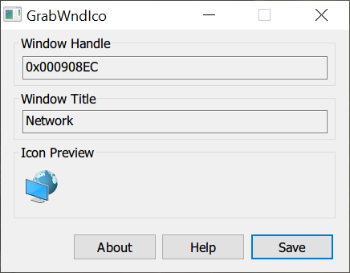

# GrabWndIco

A lightweight tool designed to grab the icon of foreground window on Windows, made with Red Panda C++ in native Win32 C.

The hotkey registered to grab foreground window icon is Ctrl + Shift + G.

Once an icon is obtained, it will be displayed on the Icon Preview sector of the main dialog, together with handle and title of the window, and then you can press the Save button to save it as a local file.

